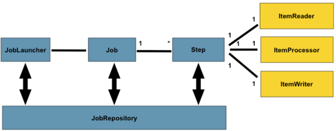
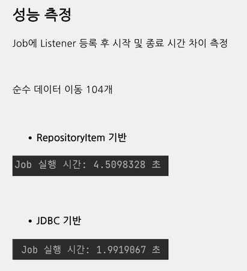

## 요구 사항
- 테이블 -> 테이블 배치
- 엑셀 -> 테이블 배치
- 테이블 -> 엑셀 배치
- 웹API -> 테이블 배치

---

## 프로젝트 세팅
- Spring Batch 5.1.2
- MySQL 8.3.0
- JDBC API
- Spring Data JPA
- Lombok

---

### 스프링 배치 모식도



- JobRepository: Job과 Step의 메타데이터를 저장하는 레포지토리

### (1) 테이블 마이그레이션 - 동일 DB 내 테이블 to 데이터

- Read : BeforeEntity 테이블에서 읽어오는 Reader
- Process : 읽어온 데이터를 처리하는 Process
- Write : AfterEntity에 처리한 결과를 저장하는 Writer

```java
@Bean
public ItemReader<BeforeEntity> beforeReader() {
    return new RepositoryItemReaderBuilder<BeforeEntity>()
            .name(BEFORE_READER)
            .repository(beforeRepository)
            .methodName("findAll")
            .sorts(Map.of("id", Sort.Direction.ASC))
            .pageSize(10)
            .build();
}

@Bean
public ItemProcessor<BeforeEntity, AfterEntity> middleProcessor() {
    return item -> AfterEntity.created(item);
}

@Bean
public ItemWriter<AfterEntity> afterWriter() {
    return new RepositoryItemWriterBuilder<AfterEntity>()
            .repository(afterRepository)
            .methodName("save")
            .build();
}
```

### (2) 실행 및 스케줄 - API or Schedule

- 방법1: 요청을 Handler로 받아서 실행하는 방법
- 방법2: 스케줄러를 통해 주기적으로 실행하는 방법

자동 실행 방지되도록 설정했기 때문에 별도 트리거가 되게 설정해야 함
```yaml
spring:
  batch:
    job:
      enabled: false # 배치 자동 실행 방지 - 애플리케이션이 시작될 때 배치가 실행되지 않도록 하기 위함
```

- JobLauncher: Job을 실행하는 인터페이스
- JobRegistry: Job을 등록하고 조회하는 인터페이스

#### 방법1: 요청을 Handler로 받아서 실행하는 방법

```java
@RestController
@RequiredArgsConstructor
public class MainController {

    private final JobLauncher jobLauncher;
    private final JobRegistry jobRegistry;

    @GetMapping("/api/first")
    public String first(
            @RequestParam String value
    ) throws NoSuchJobException,
            JobInstanceAlreadyCompleteException,
            JobExecutionAlreadyRunningException,
            JobParametersInvalidException,
            JobRestartException
    {
        JobParameters jobParameters = new JobParametersBuilder()
                .addString("date", value)
                .toJobParameters();

        jobLauncher.run(jobRegistry.getJob("firstJob"), jobParameters);
        
        return "ok";
    }

}
```

#### 방법2: 스케줄러를 통해 주기적으로 실행하는 방법

```java
@Configuration
@RequiredArgsConstructor
public class FirstSchedule {

    private final JobLauncher jobLauncher;
    private final JobRegistry jobRegistry;

    @Scheduled(cron = "10 * * * * *", zone = "Asia/Seoul")
    public void runFirstJob() throws NoSuchJobException, JobInstanceAlreadyCompleteException, JobExecutionAlreadyRunningException, JobParametersInvalidException, JobRestartException {

        System.out.println("first schedule start");

        SimpleDateFormat dateFormat = new SimpleDateFormat("yyyy-MM-dd-hh-mm-ss");
        String date = dateFormat.format(new Date());

        JobParameters jobParameters = new JobParametersBuilder()
                .addString("date", date)
                .toJobParameters();

        jobLauncher.run(jobRegistry.getJob("firstJob"), jobParameters);
    }
}
```

### (3) 데이터 업데이트 - 동일 테이블 내 컬럼값을 읽어서 조건에 따라 업데이트
```java
@Bean
public Step secondStep() {

    return new StepBuilder("secondStep", jobRepository)
            .<WinEntity, WinEntity> chunk(10, platformTransactionManager)
            .reader(winReader())
            .processor(trueProcessor())
            .writer(winWriter())
            .build();
}

@Bean
public RepositoryItemReader<WinEntity> winReader() {

    return new RepositoryItemReaderBuilder<WinEntity>()
            .name("winReader")
            .repository(winRepository)
            .methodName("findByWinGreaterThanEqual")
            .arguments(Collections.singletonList(10L))
            .sorts(Map.of("id", Sort.Direction.ASC))
            .pageSize(10)
            .build();
}

@Bean
public ItemProcessor<WinEntity, WinEntity> trueProcessor() {
    return item -> {
        item.setReward(true);
        return item;
    };
}

@Bean
public RepositoryItemWriter<WinEntity> winWriter() {
    return new RepositoryItemWriterBuilder<WinEntity>()
            .repository(winRepository)
            .methodName("save")
            .build();
}
```

### (4) 영속성별 구현 방법

MongoDB, JPA, JDBC 등 영속성에 따라 구현 방법이 다름

- JDBC
  - reader
    - Cursor: 데이터베이스 자체의 cursor를 사용하여 전체 테이블에서 cursor가 한 칸씩 이동하며 데이터를 가져옴
    - Paging: 데이터 테이블에서 묶음 단위로 데이터를 가져오는 방식으로 SQL 구문 생성시 offset과 limit를 배치단에서 자동으로 조합하여 쿼리를 실행함
    - https://docs.spring.io/spring-batch/reference/readers-and-writers/database.html

```java
@Bean
public JdbcCursorItemReader<CustomerCredit> itemReader(DataSource dataSource) {
    String sql = "select ID, NAME, CREDIT from CUSTOMER";
    return new JdbcCursorItemReaderBuilder<CustomerCredit>().name("customerReader")
            .dataSource(dataSource)
            .sql(sql)
            .rowMapper(new CustomerCreditRowMapper())
            .build();
}
```

```java
// Paging
@Bean
@StepScope
public JdbcPagingItemReader<CustomerCredit> itemReader(DataSource dataSource,
@Value("#{jobParameters['credit']}") Double credit) {
        Map<String, Object> parameterValues = new HashMap<>();
        parameterValues.put("statusCode", "PE");
        parameterValues.put("credit", credit);
        parameterValues.put("type", "COLLECTION");

        return new JdbcPagingItemReaderBuilder<CustomerCredit>().name("customerReader")
                .dataSource(dataSource)
                .selectClause("select NAME, ID, CREDIT")
                .fromClause("FROM CUSTOMER")
                .whereClause("WHERE CREDIT > :credit")
                .sortKeys(Map.of("ID", Order.ASCENDING))
                .rowMapper(new CustomerCreditRowMapper())
                .pageSize(2)
                .parameterValues(parameterValues)
                .build();
}
```

---

### 테이블 to 엑셀

"엑셀 → 테이블"은 중간에 종료되더라도 중단점부터 실행하면 효율적이지만 “테이블 → 엑셀”이 실패하면 파일을 새로 만들어야되기 때문에 중단점이 아니라 처음부터 배치를 처리하도록 설정해야 함
(상황에 따라 다르겠지만, 파일을 만든다고 가정하면 새로 시작, 파일이 정의되어 있고 이어쓴다면 이어지는 부분 부터 진행)


---

### ItemStreamReader

ExecutionContext

배치 작업 처리시 기준점을 잡을 변수를 계속하여 트래킹하기 위한 저장소로 사용

ExecutionContext 데이터는 JdbcExecutionContextDao에 의해 메타데이터 테이블에 저장되며 범위에 따라 아래와 같이 나뉩니다.

BATCH_JOB_EXECUTION_CONTEXT
BATCH_STEP_EXECUTION_CONTEXT

### Step 설정

Step은 배치 작업을 처리하는 하나의 묶음

두 가지 방식
- Chunk 방식 처리 (Read → Process → Write)
- Tasklet 방식 처리

Tasklet 방식은 아주 간단한 동작만 하기 때문에 거의 사용되지 않음 (단순 파일 삭제, 값 초기화)


- Step : Chunk 단위 처리 과정
청크 값을 10으로 설정 했다면 (Read) X 10 → (Process) X 10 → Write

- Skip
Skip은 Step의 과정 중 예외가 발생하게 되면 예외를 특정 수 까지 건너 뛸 수 있도록 설정하는 방법
```java
@Bean
public Step sixthStep() {

    return new StepBuilder("sixthStep", jobRepository)
            .<BeforeEntity, AfterEntity> chunk(10, platformTransactionManager)
            .reader(beforeSixthReader())
            .processor(middleSixthProcessor())
            .writer(afterSixthWriter())
            .faultTolerant()
            .skip(Exception.class) // 블랙리스트 방식으로 보통 구현한다고 함
            .noSkip(FileNotFoundException.class)
            .noSkip(IOException.class)
            .skipLimit(10) // 10번까지만 스킵
            .build();
}
```
https://docs.spring.io/spring-batch/reference/step/chunk-oriented-processing/configuring-skip.html

- Retry
Retry는 Step의 과정 중 예외가 발생하게 되면 예외를 특정 수 까지 반복 할 수 있도록 설정하는 방법
```java
@Bean
public Step sixthStep() {

    return new StepBuilder("sixthStep", jobRepository)
            .<BeforeEntity, AfterEntity> chunk(10, platformTransactionManager)
            .reader(beforeSixthReader())
            .processor(middleSixthProcessor())
            .writer(afterSixthWriter())
            .faultTolerant()
            .retryLimit(3)
            .retry(SQLException.class)
            .retry(IOException.class)
            .noRetry(FileNotFoundException.class)
            .build();
}
```
https://docs.spring.io/spring-batch/reference/step/chunk-oriented-processing/retry-logic.html

- Write 롤백 제어
Writer시 특정 예외에 대해 트랜잭션 롤백을 제외하는 방법
```java
@Bean
public Step step1(JobRepository jobRepository, PlatformTransactionManager transactionManager) {
	return new StepBuilder("step1", jobRepository)
				.<String, String>chunk(2, transactionManager)
				.reader(itemReader())
				.writer(itemWriter())
				.faultTolerant()
				.noRollback(ValidationException.class)
				.build();
}
```

- Step Listener
  stepListener는 Step의 실행 전후에 특정 작업을 수행 시킬 수 있는 방법<br/>
- 로그를 남기거나 다음 Step이 준비가 되었는지, 이번 Step과 다음 Step이 의존되는 경우 변수 정리를 진행할 수 있음
```java
@Bean
public StepExecutionListener stepExecutionListener() {

    return new StepExecutionListener() {
        @Override
        public void beforeStep(StepExecution stepExecution) {
            StepExecutionListener.super.beforeStep(stepExecution);
        }

        @Override
        public ExitStatus afterStep(StepExecution stepExecution) {
            return StepExecutionListener.super.afterStep(stepExecution);
        }
    };
}

@Bean
public Step sixthStep() {

    return new StepBuilder("sixthStep", jobRepository)
            .<BeforeEntity, AfterEntity> chunk(10, platformTransactionManager)
            .reader(beforeSixthReader())
            .processor(middleSixthProcessor())
            .writer(afterSixthWriter())
            .listener(stepExecutionListener())
            .build();
}
```

---

### Job 설정

Step flow

- 순차적으로 Step 실행 

가장 첫 번째 실행될 Step만 start() 메소드로 설정한 뒤, next()로 이어주면 됨<br/>
다만 앞선 Step이 실패할 경우 연달아 등장하는 Step 또한 실행되지 않음
 
```java
@Bean
public Job footballJob(JobRepository jobRepository) {
    return new JobBuilder("footballJob", jobRepository)
                     .start(playerLoad())
                     .next(gameLoad())
                     .next(playerSummarization())
                     .build();
}
```

- 조건에 따라 실행
```java
@Bean
public Job job(JobRepository jobRepository, Step stepA, Step stepB, Step stepC, Step stepD) {
	return new JobBuilder("job", jobRepository)
				.start(stepA)
				.on("*").to(stepB)
				.from(stepA).on("FAILED").to(stepC)
				.from(stepA).on("COMPLETED").to(stepD)
				.end()
				.build();
}
```

```java
@Bean
public JobExecutionListener jobExecutionListener() {
    
    return new JobExecutionListener() {
        @Override
        public void beforeJob(JobExecution jobExecution) {
            JobExecutionListener.super.beforeJob(jobExecution);
        }

        @Override
        public void afterJob(JobExecution jobExecution) {
            JobExecutionListener.super.afterJob(jobExecution);
        }
    };
}

@Bean
public Job sixthBatch() {

    return new JobBuilder("sixthBatch", jobRepository)
            .start(sixthStep())
            .listener(jobExecutionListener())
            .build();
}
```

https://docs.spring.io/spring-batch/reference/step/controlling-flow.html


---

### JPA 성능 문제와 JDBC

write 부분을 JPA로 구성할 경우 JDBC 대비 처리 속도가 느림

- 성능 저하 이유 : bulk 쿼리 실패

Entity의 Id 생성 전략은 보통 IDENTITY로 설정함<br/>
이 경우 JPA는 엔티티를 저장할 때마다 DB에 쿼리를 날려서 가장 마지막 값 보다 1을 증가 시킨 값을 저장함<br/>
여기서 Batch 처리 청크 단위 bulk insert 수행이 무너짐

JDBC 기반으로 작성하게 된다면 청크로 설정한 값이 모이게 된다면 bulk 쿼리로 단 1번의 insert가 수행되지만 JPA의 IDENTITY 전략 때문에 bulk 쿼리 대신 각각의 수만큼 insert가 수행됨

```java
@Bean
public RepositoryItemWriter<AfterEntity> afterSixthWriter() {

    return new RepositoryItemWriterBuilder<AfterEntity>()
            .repository(afterRepository)
            .methodName("save")
            .build();
}

@Bean
public JdbcBatchItemWriter<AfterEntity> afterSixthWriter() {

    String sql = "INSERT INTO AfterEntity (username) VALUES (:username)";

    return new JdbcBatchItemWriterBuilder<AfterEntity>()
            .dataSource(dataSource)
            .sql(sql)
            .itemSqlParameterSourceProvider(new BeanPropertyItemSqlParameterSourceProvider<>())
            .build();
}
```



